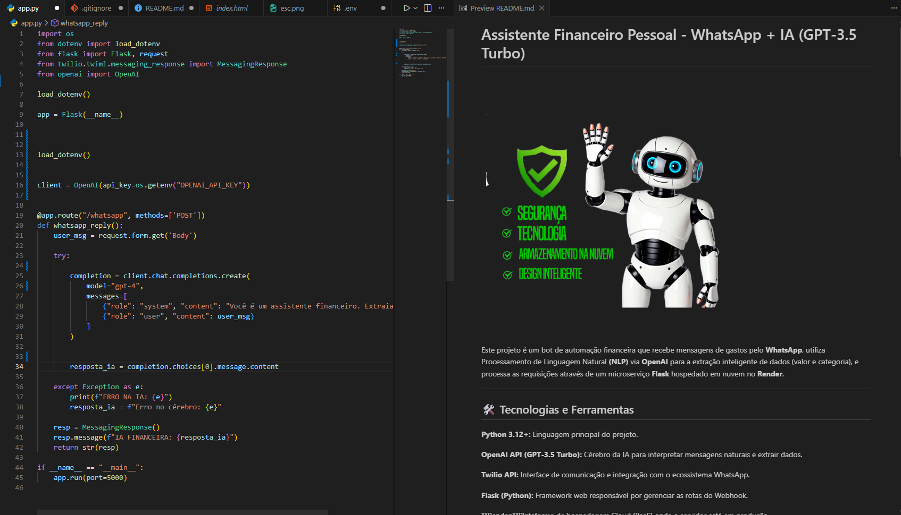

#  Assistente Financeiro Pessoal - WhatsApp + IA (GPT-3.5 Turbo)

 Este projeto é um bot de automação financeira que recebe mensagens de gastos pelo **WhatsApp**, utiliza Processamento de Linguagem Natural **(NLP)** via **OpenAI** para a extração inteligente de dados (valor e categoria), e processa as requisições através de um microserviço **Flask** hospedado em nuvem no **Render**.
 
---
## 🛠️ Tecnologias e Ferramentas

**Python 3.12+:** Linguagem principal do projeto.

**OpenAI API (GPT-3.5 Turbo):** Cérebro da IA para interpretar mensagens naturais e extrair dados.

**Twilio API:** Interface de comunicação e integração com o ecossistema WhatsApp.

**Flask (Python):** Framework web responsável por gerenciar as rotas do Webhook.

**Render:**Plataforma de hospedagem Cloud (PaaS) onde o servidor está em produção.

**Gunicorn:** Servidor HTTP WSGI de nível de produção (usado no Render para rodar o Flask).

**python-dotenv:** Gerenciamento de variáveis de ambiente e chaves de API com segurança.

---
## 🚀 Arquitetura de Dados (Cloud)

**Interface:** Mensagem enviada via WhatsApp.

**Bridge:** Twilio processa e redireciona via Webhook.

**Servidor:** Flask hospedado em https://assistente-financeiro-ia.onrender.com.

**Cérebro:** OpenAI API (Extração: Pizza | R$ 50,00).

**Feedback:** Resposta estruturada entregue ao usuário.

---
## 📸 Demonstração
    

---
## ⚠️ Pontos de Atenção & Próximos Passos (Escalabilidade)

**Para que este assistente deixe de ser um MVP (Mínimo Produto Viável) e se torne um produto comercializável, os seguintes pontos precisam ser implementados:**

---
***Persistência de Dados (Banco de Dados):***

**Atual:** Os dados são processados, mas se perdem após a resposta.

**Necessário:** Integrar um banco de dados (PostgreSQL ou MongoDB) para armazenar o histórico de gastos de cada usuário.

---
***Autenticação e Multi-usuário:***

**Atual:** O sistema não diferencia quem é quem se várias pessoas mandarem mensagem.

**Necessário:** Criar uma lógica para identificar o usuário pelo número do WhatsApp e isolar seus dados.

---
***Upgrade de Infraestrutura (Plano Pro):***

**Problema:** O plano Free do Render sofre "Cold Start" (demora para iniciar), o que pode causar timeouts no Twilio.

**Solução:** Migrar para uma instância Web Service paga para garantir resposta instantânea.

---
***Segurança e Validação:***

**Necessário:** Implementar validação de assinaturas do Twilio (X-Twilio-Signature) para garantir que apenas mensagens vindas do Twilio consigam acessar sua API no Render.

---
***Gestão de Contexto:***

**Necessário:** Fazer com que a IA lembre de mensagens anteriores (ex: "Quanto gastei no total hoje?"), o que exige o uso de Threads ou armazenamento de estado da conversa.

---
### 🔒 Segurança
O projeto utiliza um arquivo `.env` para proteger a `OPENAI_API_KEY`, garantindo que credenciais sensíveis não sejam expostas publicamente no repositório.
