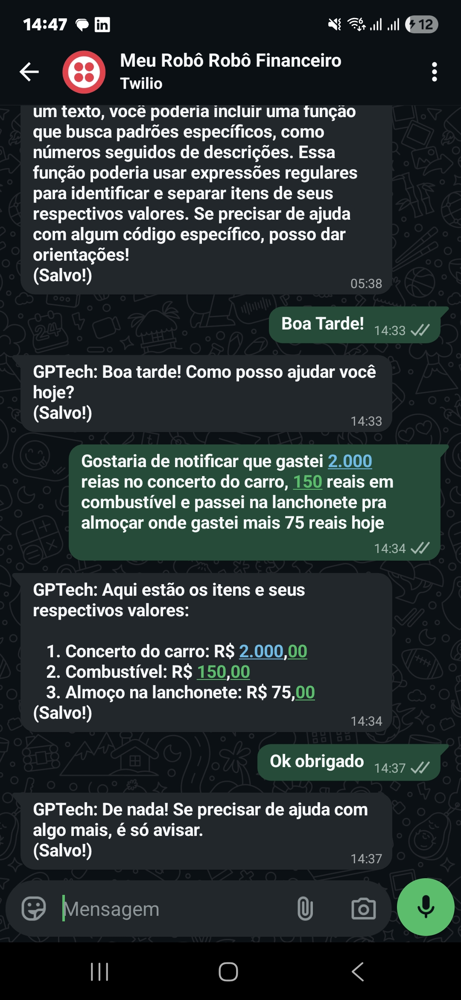

 Este projeto é um bot de automação financeira que recebe mensagens de gastos pelo **WhatsApp**, utiliza Processamento de Linguagem Natural **(NLP)** via **OpenAI** para a extração inteligente de dados (valor e categoria), e processa as requisições através de um microserviço **Flask** hospedado em nuvem no **Render**.
---

---
## 🛠️ Tecnologias e Ferramentas

**Python 3.12+:** Linguagem principal do projeto.

**OpenAI API (GPT-4o-mini):** Cérebro da IA para interpretar mensagens naturais e extrair dados.

**PostgreSQL (Neon):** Banco de dados SQL serverless para armazenamento permanente do histórico de gastos.

**Twilio API:** Interface de comunicação e integração com o ecossistema WhatsApp.

**Flask (Python):** Framework web responsável por gerenciar as rotas do Webhook.

**Render:** Plataforma de hospedagem Cloud (PaaS) onde o servidor está em produção.

**Gunicorn:** Servidor HTTP WSGI de nível de produção (usado no Render para rodar o Flask).

**Render Env Vars:** Gerenciamento de credenciais (API Keys e DB URL) diretamente na infraestrutura da nuvem, eliminando a necessidade de arquivos sensíveis em produção.

**python-dotenv:** Utilizado exclusivamente em ambiente de desenvolvimento local para carregar as variáveis de teste.

---
## 🚀 Arquitetura de Dados (Cloud)

**Interface:** Mensagem enviada via WhatsApp.

**Bridge:** Twilio processa e redireciona via Webhook.

**Servidor:** Flask hospedado em https://assistente-financeiro-ia.onrender.com.

**Cérebro:** OpenAI API extrai os dados (Item: Jantar | Valor: 80.00 | Categoria: Alimentação).

**Banco de Dados:** Os dados são salvos de forma persistente no Neon PostgreSQL.

**Feedback:** Resposta estruturada entregue ao usuário.

---
## 📸 Demonstração
 

---
## ⚠️ Pontos de Atenção & Próximos Passos (Escalabilidade)

**Para que este assistente deixe de ser um MVP (Mínimo Produto Viável) e se torne um produto comercializável, os seguintes pontos precisam ser implementados**

---
***Autenticação e Multi-usuário***

**Atual:** O sistema não diferencia quem é quem se várias pessoas mandarem mensagem.

**Necessário:** Criar uma lógica para identificar o usuário pelo número do WhatsApp e isolar seus dados.

---
***Upgrade de Infraestrutura (Plano Pro***

**Problema:** O plano Free do Render sofre "Cold Start" (demora para iniciar), o que pode causar timeouts no Twilio.

**Solução:** Migrar para uma instância Web Service paga para garantir resposta instantânea.

---
***Segurança e Validação***

**Necessário:** Implementar validação de assinaturas do Twilio (X-Twilio-Signature) para garantir a autenticidade das requisições ao Webhook.

---
### 🔒 Segurança
O projeto utiliza variáveis de ambiente para proteger a OPENAI_API_KEY e a DATABASE_URL. Em produção (Render), as chaves são injetadas diretamente no container, enquanto localmente utiliza-se um arquivo .env (ignorado pelo Git) para garantir que credenciais sensíveis não sejam expostas publicamente no repositório.
